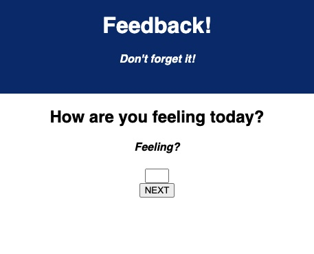
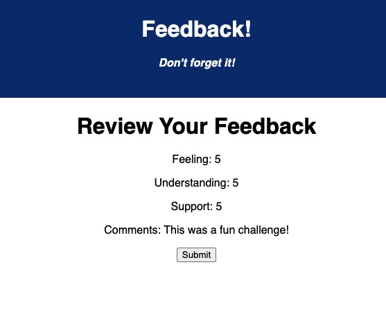

# Project Name

Redux Feedback Loop

## Description

In this application, I created a reflection/feedback form modeled from the daily reflection system employed by the instructors at Prime Digital Academy. I had to consider how to navigate from page to page, temporarily storing user feedback data in a Redux store and present all the user's responses on the DOM for review. Then  submit this data to the server for a final push into a database for longer-term storage. 

To accomplish this task, I had to establish a Redux Store and created Reducers in the index.js file to take user input data and return a new result to be dispatched page by page. These results are temporarily stored in our Redux Store until the user completes the survey and their results are ready to be submitted.

I went on to created components for each of our forms which enables a user's actions (responses) to be collected and dispatched to the next page until we reach the review page which sends data to the server, which is then subsequently sent to a database via an axios POST route for longer term storage. A thank you page that clears the temporary Redux Store data for the next user to complete the feedback survey.

To stage all the actions required to make this application possible, had to use the App.jsx file to declare a router which contains our components wrapped in routers that define the paths of the pages in this web application.

To see the fully functional site, please visit: https://git.heroku.com/danny-made-a-feedback-app.git

## Application Images

This is one of the application form pages

This is the review page you are navigated to upon completion of the survey
 

## Prerequisites
- React.js
- Node.js
- Redux.js
- posgreSQL

## Installation

1. Create a database named prime_feedback
2. The queries in the data.sql are set up to create the table and populate it to enable app functionality, we recommend using Postico
3. Open VS Code and run npm install
4. Run npm run server
5. Open another tab in your terminal and run npm run client
6. npm run client will open up a new browser tab

## Usage

1. Fill out a score from 1-5 for each question you're prompted to answer.
2. Hit next to navigate through each question page, you will not be able to move on until you fill in a value for each input (except leaving a comment, that is optional)
3. Review your responses when you get to the review page and hit submit!
4. You will reach a thank you page which shows you've completed the survey.
5. Click 'Leave New Feedback' to reset the survey and navigate back to the home page

## Built With

The JavaScript programming language utilizing the React framework brought this application to life. Postico was utilized as the client side GUI for viewing and storing user data whilst building this application.

## Acknowledgement

Thanks to my instructors and classmates Prime Digital Academy for providing me with the tools to make this project go live!

## Support

If you have any suggestions or issues, please email me at dannymussie7@gmail.com 

